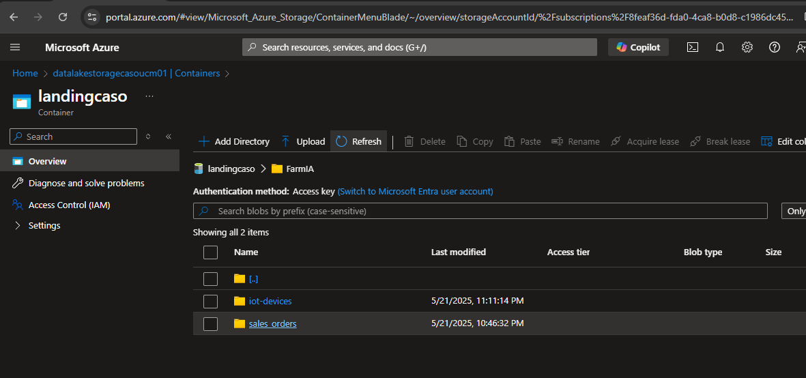

# Proyecto de Motor de Ingesta

## Bienvenido!

Este README te indica cual es la arquitectura propuesta y simulada en este motor de ingesta, haciendo un recuento de los entregables:

● Diseño de la arquitectura del data lakehouse (documento con diagrama yexplicaciones).

    **Este se encuentra en el apartado "Arquitectura del proyecto" en este mismo README**

● Código del motor de ingesta en Python y configuración de datasets.
    
    **Si bien se generá un wheel para el uso en databricks, puedes encontrar las entrañas del motor en la carpeta MotorIngesta**

● Guía de ejecución y despliegue (README con instrucciones).

    **Este se encuentra en el apartado "Puesta en marcha" en este mismo README**

## Instalación

Clona el repositorio en tu máquina local.
   ```bash
   git clone <URL_DEL_REPOSITORIO>
   cd Motor de ingesta
```

Levantar un entorno virtual

## Crear un Entorno Virtual

### Windows
```bash
python -m venv nombre_del_entorno
```

### Linux y macOS
```bash
python3 -m venv nombre_del_entorno
```

Reemplaza `nombre_del_entorno` con el nombre que desees para tu entorno virtual.

Cuando se finalice la instalación se puede ejecutar el siguiente comando:

```bash
   python setup.py bdist_wheel
```

Esto creará el wheel para poder usarlo junto con los notebooks.

## Puesta en Marcha

1. Asegúrate de que todos los servicios necesarios estén en funcionamiento.

    - Cluster de Databricks.
    - Containers creados:
        - datalakecaso
        - landingcaso

2. Descarga el archivo wheel generado con los comandos anteriores, este se encontrará en la ruta **dist/** con el nombre **motor_ingesta-0.1.0-py3-none-any.whl**

3. Instala el archivo wheel en tu clúster de Databricks.

    3.1. En tu cluster de databricks busca la opción "Computo"

    

    3.2. Selecciona tu cluster y ve a Libraries/Librerias y selecciona "Install New":

    

    3.3 En este pop up arrastra y suelta el archivo wheel ".whl"

    

4. Asegúrate de que las siguientes librerías estén instaladas en tu clúster de Databricks:
   - confluent_kafka
   - fastavro
   - httpx
   - attrs
   - authlib
   - faker
5. En la carpeta `notebooks` encontraras 3 notebooks que se deberán subir a tu workspace de databricks:

    1. motor_de_ingesta: Este tiene el contenido del uso del motor de ingesta para llevar a de landing y de kafka topics a la capa bronze.
    2. files_generation: Este genera nuevos files según el tipo específicado a la capa landing simulando la etapa de ingesta Batch.
    3. messages_generation: Este genera nuevos mensajes a los topics de kafka de la cuenta configurada.

6. Ejecuta el notebook de motor de ingesta para verificar que todo funciona correctamente, ejecutando a gusto los de generación de files y mensajes en kafka para evaluar el comportamiento.

## Arquitectura del Proyecto

La arquitectura del data lakehouse para FarmIA está diseñada para manejar eficientemente la ingesta, almacenamiento, procesamiento y servicio de datos. A continuación se describe cada etapa:


#### Sources

Este contiene todas las posibles fuentes de datos, por convención se tomarán de la siguiente forma:

- **Streaming**: Datos de ventas online Capturados desde plataformas de comercio electrónico.
- **Batch**: Registros de inventario, Datos de proveedores y logística, Información meteorológica externa, Sensores IoT

#### Ingestion
- **Backend o Aplicación**: Interactúa con los dispositivos moviles hace las veces de productor de mensajes.
- **DataBricks Cluster**: Procesa los batch de sus diferentes origenes de datos.

#### Storage
- **Landing**: Almacena datos crudos tal como se ingirieron vía Batch.
- **Bronze**: Datos originados de traer de landing y eventos de topics kafka listos para limpieza y enriquecimiento.
- **Silver**: Datos limpios y enriquecidos, preparados para análisis detallados.
- **Gold**: Datos altamente refinados, optimizados para el consumo por aplicaciones de negocio.

#### Processing
- **Spark Streaming**: Procesa datos en tiempo real desde Kafka.
- **Apache Spark**: Realiza transformaciones y análisis de datos batch.

#### Serving
- **Power BI y Tableau**: Herramientas de visualización utilizadas para consumir y analizar los datos refinados (propuesta).

Esta arquitectura permite a FarmIA manejar eficientemente grandes volúmenes de datos, proporcionando escalabilidad y flexibilidad en el procesamiento y análisis.


# Resultados

Posterior a la ejecución de los notebooks de generación de eventos y generación de archivos

1. En el container de landing debemos tener las rutas de los archivos para dispositivos iot y sales orders:



2. Del mismo modo, debemos terner los eventos en nuestro topic de kafka, con su respectivo schema:


Por ultimo, al ejecutar el motor de ingesta, tenemos ya los datos con la metadata aregada y su particionado en la carpeta bronze:


